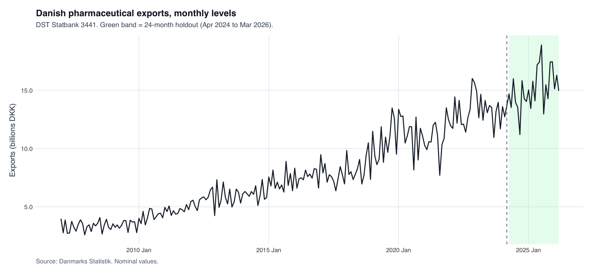
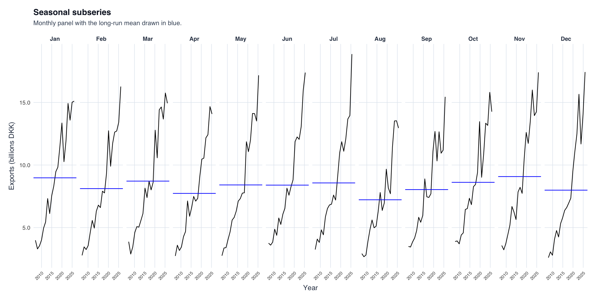
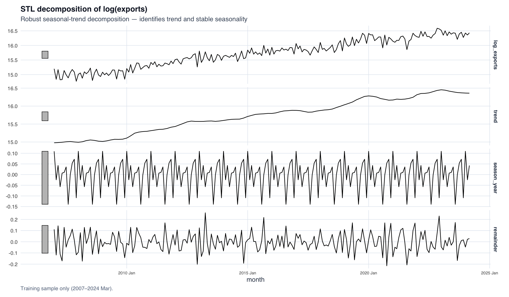
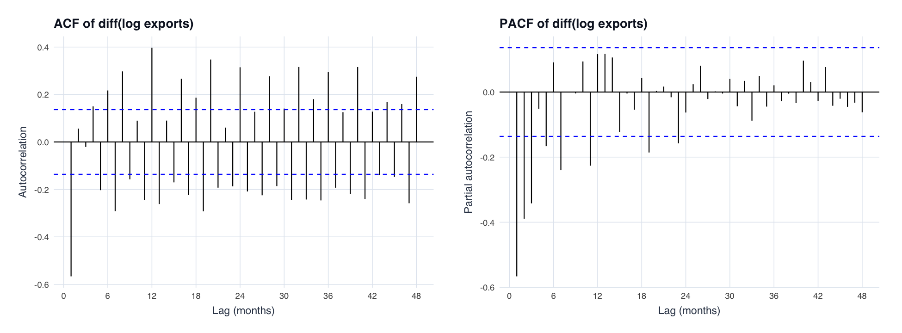
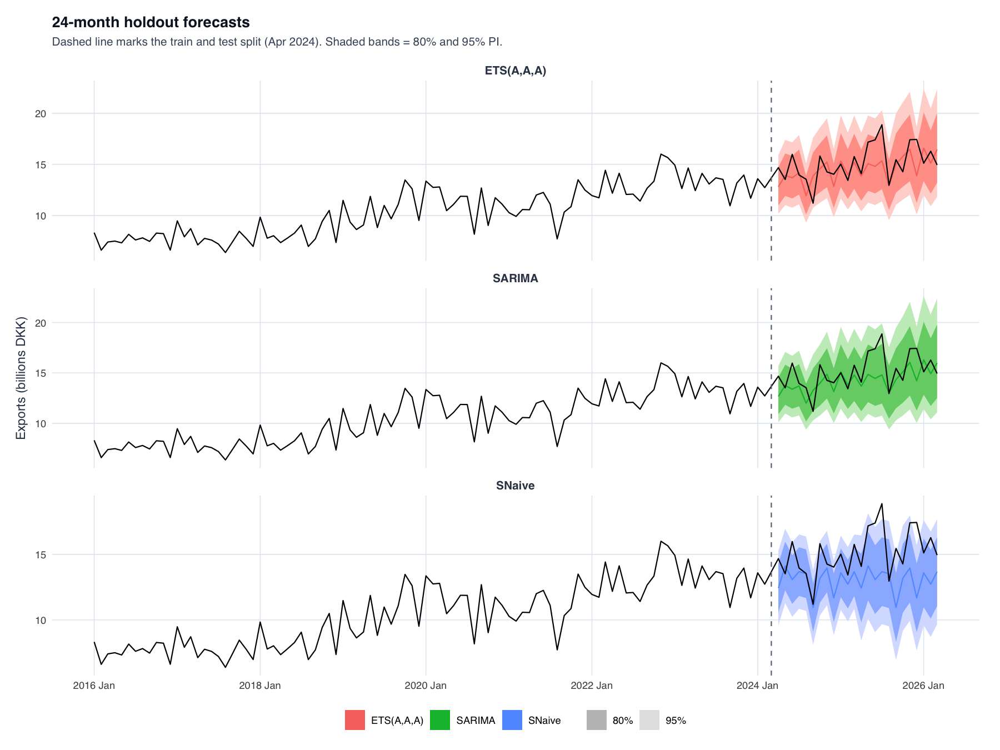
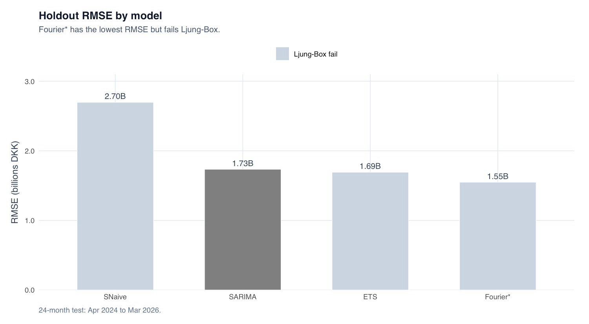
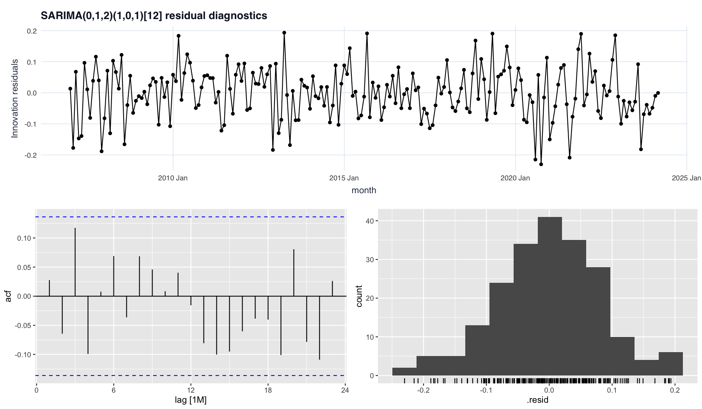

# Forecasting Danish Pharmaceutical Exports — SARIMA vs ETS

A univariate 24-month forecast of Denmark's monthly pharmaceutical exports through the GLP-1 boom, comparing the ARIMA/SARIMA family against ETS exponential smoothing under a **diagnostics-first** model-selection gate. Built on DST Statbank data (SITC 54, Jan 2007 – Mar 2026, 231 monthly observations).

> CBS Predictive Analytics final project (KAN-CDSCO1005U), 2026 · Group Fri-174161-2.
> Authors: Mikołaj Sapek, Julia Nowak, Yasemin Pagano, Peter Emil Larsen Have. Supervisor: Dimitar Yordanov.

📄 Portfolio write-up: [mikolajpawelsapek.eu](https://mikolajpawelsapek.eu/Projects/pa-pharma-forecast.html)

---

## Research question

> Can a univariate time-series model, estimated using the `fpp3` framework, produce a *diagnostically valid and accurate* 24-month forecast of Danish pharmaceutical exports?

Denmark is the EU's 8th-largest pharma exporter (≈ €13.7 bn, 2024) and pharma is ~30% of Danish goods exports. The series is hard precisely because monthly exports nearly doubled 2022→2026 (GLP-1 / Novo Nordisk demand) — a possible regime shift on top of strong seasonality and non-constant variance.

## Data

- **Source:** DST Statbank, SITC 54 (medicinal & pharmaceutical products), nominal DKK.
- **Span:** Jan 2007 – Mar 2026, **231 monthly observations**. Rises from 2.6–4.0 Bn DKK/month (2007) to 15–19 Bn DKK/month (2025–26).
- 🔗 **Dataset:** [`data/pharma_exports.csv`](data/pharma_exports.csv) (231 monthly rows, `month,exports`) — extracted from [Statistics Denmark Statbank](https://www.statbank.dk/) (SITC 54).

| Period | Mean | Min | Max | Std. dev. |
|---|---:|---:|---:|---:|
| Full sample (2007–2026) | 8.33 | 2.60 | 18.87 | 4.03 |
| Pre-2022 (2007–2021) | 6.69 | 2.60 | 10.89 | 1.82 |
| Post-2022 (2022–2026) | 14.10 | 8.91 | 18.87 | 2.41 |

*Descriptive statistics, Bn DKK. The post-2022 jump is a broad level shift, present in every calendar month.*

### Transformation & stationarity

- **Box-Cox (Guerrero):** λ = −0.0177 ≈ 0 → natural log throughout (stabilises growing seasonal swings).
- **Differencing:** `ndiffs = 1`, `nsdiffs = 0` → one regular difference, no seasonal differencing (seasonal amplitude stable).

| Test | Series | p-value | Interpretation |
|---|---|---:|---|
| KPSS | levels (Box-Cox) | 0.01 | Non-stationary → d = 1 |
| KPSS | log(exports) | 0.01 | Confirms d = 1 |
| ADF | levels | 0.21 | Unit root not rejected |
| ADF | diff(log) | 0.01 | Stationary after differencing |

**Structural breaks:** QLR/sup-F on diff(log) finds no break (p = 1.00); `gets::isat` flags only Dec 2012/Jan 2013 at 1%; Bai-Perron (BIC) selects 0 breakpoints → the acceleration is *smooth and sustained*, not a discrete break.

### Train–test split

| Set | Period | N |
|---|---|---:|
| Training | 2007M01 – 2024M03 | 207 |
| Holdout (test) | 2024M04 – 2026M03 | 24 |

*All orders/hyperparameters fixed on training before the holdout was touched. The April 2024 cutoff deliberately puts the GLP-1 boom in the test set (a hard test).*

## Methodology — the two-stage gate

1. **Stage 1 — diagnostic validity (a gate):** a model *must* return a Ljung-Box p > 0.05 at lags 12 **and** 24. Autocorrelated residuals → unreliable 80%/95% intervals → excluded regardless of accuracy.
2. **Stage 2 — out-of-sample accuracy:** among models that pass, the ARIMA winner and ETS winner go head-to-head on holdout RMSE/MAE/MAPE/MASE plus rolling-origin CV over 19 origins.

> No cross-class AIC ranking: ARIMA and ETS likelihoods are on different bases and are not comparable. Information criteria are used only *within* each class.

## Results

### ARIMA candidates

| Model | AICc | LB p (lag24) | RMSE | MAPE |
|---|---:|---:|---:|---:|
| ARIMA(0,1,1)(1,0,1)[12] | −415 | 0.093 | 1.62 | 8.65% |
| **ARIMA(0,1,2)(1,0,1)[12]** | **−417** | **0.363** | 1.73 | 8.85% |
| ARIMA(1,1,1)(1,0,1)[12] | −416 | 0.271 | 1.69 | 8.76% |
| auto.ARIMA | −399 | 0.155 | 2.02 | 9.58% |

*All four pass Ljung-Box at 5%. (0,1,2) has the lowest AICc **and** the largest LB margin → carried forward. Selected coefficients: ma1 = −0.926, ma2 = +0.166, sar1 = 0.974, sma1 = −0.845, drift retained for the sustained uptrend.*

### ETS candidates

| Model | AICc | LB p (lag24) | RMSE | MAPE |
|---|---:|---:|---:|---:|
| **ETS(A,A,A)** | 106 | **0.124** | 1.69 | 8.92% |
| ETS(A,Ad,A) / Auto ETS | 96 | 0.037 | 2.36 | 11.71% |

*Only ETS(A,A,A) passes Ljung-Box. Auto ETS picks the damped trend (better AICc) but fails diagnostics and degrades the post-2022 forecast.*

### Head-to-head & rolling cross-validation

| Model | LB p (lag24) | Holdout RMSE | CV RMSE | MASE |
|---|---:|---:|---:|---:|
| **SARIMA(0,1,2)(1,0,1)[12]** | **0.363** | 1.73 | **1.66** | 1.28 |
| ETS(A,A,A) | 0.124 | **1.69** | 1.70 | 1.26 |
| Seasonal naïve (baseline) | — | — | 1.92 | 1.00 |

*On the single holdout ETS is marginally ahead, but **SARIMA wins rolling CV** (19 origins, stretch window) on all three averaged metrics and has the wider Ljung-Box safety margin → more reliable prediction intervals. A ~2% point-accuracy gap on one split isn't decisive; CV over 19 origins is.*

> **Excluded by the gate:** ARIMA + Fourier(K=2) had the lowest holdout RMSE (1.55 Bn) **but failed Ljung-Box (p≈0)** → untrustworthy intervals → excluded. Three SARIMAX variants (GLP-1/COVID dummies) all failed at lag 24 and added no accuracy — the drift had already absorbed the trend.

**Chosen model: ARIMA(0,1,2)(1,0,1)[12] with drift.** Forecast ≈ 17 Bn DKK/month by early 2026; 80% PI ≈ 15.0–19.5, 95% PI ≈ 13.5–21.0 Bn DKK. Honest caveat: MASE = 1.28 > 1, so on this boom holdout the model is marginally worse than a naïve month-to-month guess on point accuracy — the value is in the trend and reliable intervals.

## Figures

### Seasonal subseries — a level shift, not a seasonal change

### STL decomposition of log(exports)

### ACF / PACF of differenced log exports

### Holdout forecasts

### Holdout RMSE by model

### SARIMA residual diagnostics

## Key takeaways

1. **Diagnostics-first beats chasing the lowest error:** the lowest-RMSE model (Fourier) was excluded for failing Ljung-Box — its intervals would be untrustworthy.
2. **GLP-1 / COVID step dummies added no value:** the drift term already absorbed the smooth, sustained level shift, so a one-off dummy added noise, not signal.
3. **Biggest threat:** concentration — the "macro" series is largely one firm (Novo Nordisk); a capacity or competitor shock is invisible to a univariate model.

## Reasoning behind the modelling choices

| Characteristic of the series | What it justifies | Rejected alternative |
|---|---|---|
| Seasonal swings grow with the level | Log / Box-Cox (λ ≈ 0) | Raw scale → variance breaks ARIMA/ETS assumptions |
| Unit root on level, stationary after 1 difference | d = 1 | d = 0 spurious trend; d = 2 over-differenced |
| Seasonal pattern stable in amplitude | D = 0, seasonal AR/MA at lag 12 | Seasonal difference removes a stable pattern |
| Smooth, sustained uptrend | Drift (kept despite t ≈ 1) | Step dummy is the wrong shape |
| Acceleration gradual, not a jump | No break dummy (QLR/Bai-Perron agree) | SARIMAX dummies fail Ljung-Box |
| Forecast used through its intervals | Diagnostics-first gate | Lowest-RMSE Fourier → invalid intervals |

## Limitations & future work

- **Limitations:** Novo Nordisk dominance → single-firm proxy; nominal DKK (no real/price adjustment); ETS LB p = 0.124 passes but isn't large → monitor; boom-period results may not generalise to calmer conditions.
- **Future work:** firm/product-level data; a time-varying regressor (e.g. production index) instead of a fixed step dummy; Bayesian structural time series; forecasting growth rates rather than levels.

## Method & stack

- **Models:** SARIMA, ETS, seasonal-naïve baseline; SARIMAX (COVID/GLP-1 dummies) and Fourier-ARIMA as robustness checks.
- **Validation:** Ljung-Box diagnostics, rolling-origin cross-validation (19 origins, stretch window, step 6 months).
- **Stack:** R, the `fpp3` / `fable` / `feasts` ecosystem, plus `gets` for indicator saturation and structural-break testing.

## Repository contents

- `paper.pdf` — full final paper (method, results, diagnostics, limitations, oral-defence Q&A)
- `figures/` — all figures used in the paper and README

## License

Released under the MIT License. Underlying data © Statistics Denmark (DST Statbank), used under their open-data terms.
